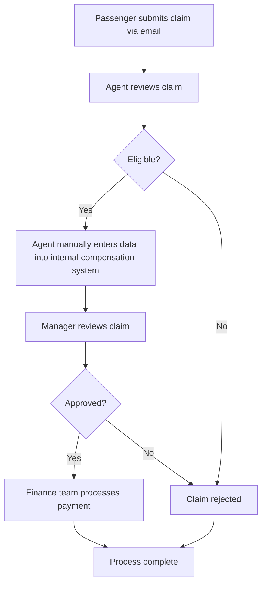

# Hyper Automation Analyst - Take-Home Assignment

## Task 1: Business Process Documentation

### Current Passenger Compensation Process Flow Diagram



### Explanation of Each Step

1. **Passenger Submits Claim via Email**: Passengers who experience flight delays or cancellations send compensation claims through email, providing details about their booking and the issue encountered.

2. **Agent Reviews Claim**: A customer service agent reviews the incoming email, extracts relevant information, and determines if the claim meets eligibility criteria.

3. **Eligibility Verification**: The agent checks if the claim complies with company policies regarding compensation eligibility based on factors such as delay duration, cause of delay, and ticket type.

4. **Manual Data Entry**: For eligible claims, the agent manually inputs passenger data, flight details, and compensation information into the internal compensation system.

5. **Manager Approval**: A manager reviews the claim in the system and makes the final decision to approve or reject the compensation request.

6. **Payment Processing**: For approved claims, the finance team processes the compensation payment to the passenger.

### Inefficiencies and Pain Points

1. **Manual Email Processing**
   - **Pain Point**: Agents spend significant time monitoring email inboxes, reading through unstructured emails, and extracting relevant information.
   - **Impact**: High processing time per claim, potential for missed emails, and inconsistent response times.
   - **Automation Opportunity**: Implement email parsing automation to extract key claim information using natural language processing and automatically categorize claims.

2. **Manual Data Entry**
   - **Pain Point**: Agents manually retype passenger and flight information into the compensation system.
   - **Impact**: Prone to human error, time-consuming, and creates a bottleneck in the process.
   - **Automation Opportunity**: Develop direct integration between email processing and the compensation system to eliminate manual data entry.

3. **Eligibility Verification**
   - **Pain Point**: Agents must interpret company policies and manually check flight data to determine eligibility.
   - **Impact**: Inconsistent application of policies, potential for errors, and significant time spent on verification.
   - **Automation Opportunity**: Create an automated rules engine that applies eligibility criteria consistently based on flight data from internal systems.

4. **Multiple Approval Layers**
   - **Pain Point**: All claims require manager review regardless of value or complexity.
   - **Impact**: Creates bottlenecks, extends processing time, and inefficiently uses manager resources.
   - **Automation Opportunity**: Implement automated approval for standard claims below a certain threshold value, with managers only reviewing exceptions or high-value claims.

5. **Manual Payment Processing**
   - **Pain Point**: Finance team manually processes each approved payment.
   - **Impact**: Delays in compensation delivery and additional manual effort.
   - **Automation Opportunity**: Automate payment initiation through integration with payment systems, with batch processing for efficiency.

## Task 2: Business Requirements Documentation

### Business Requirements Document (BRD)

#### 1. Executive Summary

WestJet is seeking to automate the passenger compensation process for flight delays and cancellations using Microsoft Power Platform. This document outlines the business requirements for this automation initiative to improve efficiency, reduce processing time, enhance customer satisfaction, and ensure consistent application of compensation policies.

#### 2. Project Summary

The Passenger Compensation Automation Project aims to transform the current manual process for handling flight delay and cancellation compensation claims into a streamlined, automated workflow. The solution will leverage Microsoft Power Platform to process incoming claims from email submission through payment disbursement with minimal manual intervention. The project will digitize and automate all stages of the compensation process, including claim receipt, eligibility verification, approval workflow, and payment processing.

#### 2. Project Overview

**Project Name**: WestJet Passenger Compensation Automation

**Business Need**: The current manual compensation process is time-consuming, prone to errors, and results in inconsistent customer experiences. Automation will streamline operations, reduce costs, and improve customer satisfaction.

#### 3. Business Objectives

The key business objectives for this automation initiative are:

- Reduce claim processing time by 70% (from days to hours)
- Decrease operational costs by 50% through reduced manual labor
- Improve accuracy of claim processing to 99%
- Enhance customer satisfaction through faster resolution and communication
- Enable staff to focus on complex cases and higher-value customer service
- Scale claims processing capacity without proportional increase in staffing
- Maintain 100% compliance with relevant regulations and company policies
- Create a consistent, transparent process for all compensation claims

#### 4. Key Stakeholders

The following stakeholders are critical to the success of this automation initiative:

- **Customer Service Department**: Primary users of the system who will benefit from reduced manual workload
- **Finance Department**: Responsible for payment processing and financial reconciliation
- **IT Department**: Provides technical support and ensures integration with existing systems
- **Legal/Compliance Team**: Ensures the solution meets regulatory requirements for passenger compensation
- **Operations Management**: Monitors overall process performance and resource allocation
- **Passengers**: End recipients of the compensation who will benefit from faster processing
- **Executive Leadership**: Sponsors project funding and requires reporting on ROI and performance
- **Flight Operations Team**: Provides flight delay/cancellation data necessary for claim validation

#### 3. Current Process Assessment

The current process is entirely manual, involving email claim submission, manual review, data entry, manager approval, and payment processing. Key pain points include:
- Labor-intensive email management
- Manual data entry causing errors and delays
- Inconsistent application of eligibility criteria
- Approval bottlenecks
- Slow payment processing

#### 4. Functional Requirements

##### 4.1 Email Processing Automation

| Req ID | Requirement Description | Priority |
|--------|-------------------------|----------|
| FR-1.1 | System must automatically detect and extract incoming compensation claim emails from designated mailbox | High |
| FR-1.2 | System must parse unstructured email content to identify key data elements (passenger name, booking reference, flight number, date, issue description) | High |
| FR-1.3 | System must classify claims by type (delay, cancellation, downgrade, etc.) | Medium |
| FR-1.4 | System must acknowledge receipt of claim to passenger via automated email | Medium |
| FR-1.5 | System must flag emails with missing information for human review | High |

##### 4.2 Eligibility Verification

| Req ID | Requirement Description | Priority |
|--------|-------------------------|----------|
| FR-2.1 | System must automatically verify flight details against operational database | High |
| FR-2.2 | System must apply business rules to determine compensation eligibility based on delay duration, cause, and ticket type | High |
| FR-2.3 | System must calculate appropriate compensation amount based on established policies | High |
| FR-2.4 | System must document the eligibility decision and rationale | Medium |
| FR-2.5 | System must identify exceptional cases requiring human review | High |

##### 4.3 Automated Data Management

| Req ID | Requirement Description | Priority |
|--------|-------------------------|----------|
| FR-3.1 | System must automatically create case records in the compensation system with all relevant data | High |
| FR-3.2 | System must link supporting documentation to case records | Medium |
| FR-3.3 | System must update case status throughout the process | Medium |
| FR-3.4 | System must maintain audit trail of all actions | High |

##### 4.4 Approval Workflow

| Req ID | Requirement Description | Priority |
|--------|-------------------------|----------|
| FR-4.1 | System must automatically approve standard claims below defined threshold (e.g., $250) | High |
| FR-4.2 | System must route claims above threshold or with exceptions to appropriate manager for review | High |
| FR-4.3 | System must provide notification to managers of pending approvals | Medium |
| FR-4.4 | System must escalate overdue approvals after defined time period | Medium |

##### 4.5 Payment Processing

| Req ID | Requirement Description | Priority |
|--------|-------------------------|----------|
| FR-5.1 | System must initiate payment process for approved claims | High |
| FR-5.2 | System must support multiple payment methods (credit to original form of payment, vouchers, bank transfers) | High |
| FR-5.3 | System must batch payments for processing efficiency where appropriate | Medium |
| FR-5.4 | System must send payment confirmation to passengers | Medium |
| FR-5.5 | System must reconcile payments with financial systems | High |

##### 4.6 Reporting and Analytics

| Req ID | Requirement Description | Priority |
|--------|-------------------------|----------|
| FR-6.1 | System must provide real-time dashboard of claim volumes, processing times, and status | Medium |
| FR-6.2 | System must generate automated reports on compensation metrics | Medium |
| FR-6.3 | System must provide analytics on common causes of compensation claims | Low |
| FR-6.4 | System must track processing time KPIs | Medium |

#### 5. Non-Functional Requirements

##### 5.1 Performance and Scalability

| Req ID | Requirement Description | Priority |
|--------|-------------------------|----------|
| NFR-1.1 | System must process 95% of claims within 24 hours of receipt | High |
| NFR-1.2 | System must handle peak volumes during irregular operations (up to 500% of normal volume) | High |
| NFR-1.3 | System must support processing of at least 1,000 claims per day | Medium |

##### 5.2 Security and Compliance

| Req ID | Requirement Description | Priority |
|--------|-------------------------|----------|
| NFR-2.1 | System must comply with data protection regulations (GDPR, PIPEDA) | High |
| NFR-2.2 | System must implement role-based access controls | High |
| NFR-2.3 | System must encrypt sensitive passenger data | High |
| NFR-2.4 | System must maintain comprehensive audit logs | High |

##### 5.3 Usability

| Req ID | Requirement Description | Priority |
|--------|-------------------------|----------|
| NFR-3.1 | System must provide intuitive interface for claim reviewers | Medium |
| NFR-3.2 | System must include clear status indicators for all claims | Medium |
| NFR-3.3 | System must support mobile access for approvers | Low |

##### 5.4 Integration

| Req ID | Requirement Description | Priority |
|--------|-------------------------|----------|
| NFR-4.1 | System must integrate with email servers | High |
| NFR-4.2 | System must integrate with flight operations database | High |
| NFR-4.3 | System must integrate with financial payment systems | High |
| NFR-4.4 | System must integrate with customer relationship management systems | Medium |

#### 6. Constraints and Assumptions

**Constraints**:
- Solution must be built using Microsoft Power Platform components
- Implementation must be completed within 4 months
- Solution must comply with airline industry regulations
- System must operate within existing IT infrastructure
- Budget limitations require phased implementation approach

**Assumptions**:
- Flight operational data is available through API or database access
- Email format from customers will remain unstructured
- Existing compensation policies will remain largely unchanged
- IT support will be available for integration points

#### 7. Success Criteria for Automation Solution

The following success criteria will be used to evaluate the effectiveness of the implemented solution:

1. **Process Efficiency**:
   - 70% reduction in end-to-end processing time for standard claims
   - 90% of standard claims processed without human intervention
   - 50% reduction in manual effort required by customer service agents

2. **Quality and Accuracy**:
   - 99% accuracy in eligibility determinations compared to manual process
   - Less than 1% error rate in payment processing
   - 100% compliance with compensation policies and regulations

3. **Customer Experience**:
   - 100% of claims acknowledged within 1 hour of receipt
   - 90% of eligible claims processed to payment within 48 hours
   - 25% improvement in customer satisfaction scores related to compensation

4. **Operational Metrics**:
   - 50% reduction in operational costs related to claims processing
   - Successful handling of volume spikes (up to 500% normal volume) during irregular operations
   - System availability of 99.9% during operational hours

#### 8. Key Performance Indicators (KPIs)

Two primary KPIs to measure the effectiveness of the automated solution:

1. **Claim Resolution Time (CRT)**:
   - **Definition**: The average time from initial claim receipt to resolution (payment issued or claim denied)
   - **Current Baseline**: 96 hours (4 days)
   - **Target**: 24 hours (1 day)
   - **Measurement Method**: Timestamp tracking in the system from claim creation to final status
   - **Reporting Frequency**: Daily with weekly and monthly aggregation
   - **Business Impact**: Directly correlates to customer satisfaction and operational efficiency

2. **Straight-Through Processing Rate (STPR)**:
   - **Definition**: Percentage of claims that complete the entire process without any human intervention
   - **Current Baseline**: 0% (all claims require manual handling)
   - **Target**: 80% of all claims
   - **Measurement Method**: Count of claims processed entirely by automation divided by total claims
   - **Reporting Frequency**: Weekly with monthly trend analysis
   - **Business Impact**: Directly measures automation effectiveness and resource optimization

#### 7. Implementation Approach

The implementation will follow a phased approach:

**Phase 1**: Email processing and case creation automation
**Phase 2**: Eligibility verification and automated approvals
**Phase 3**: Payment processing automation
**Phase 4**: Reporting and analytics

Each phase will include requirements refinement, development, testing, and deployment.

## Task 3: Automation Strategy Proposal

### Executive Summary

This automation strategy proposal outlines an approach to transform WestJet's manual passenger compensation process into a streamlined, efficient automated workflow using Microsoft Power Platform. The proposed solution will reduce processing time, improve accuracy, enhance customer satisfaction, and free up staff for higher-value activities.

### Proposed Technology Stack

**Primary Platform**: Microsoft Power Platform

**Key Components**:
1. **Power Automate**: Workflow automation, email processing, approval flows
2. **Power Apps**: Custom interfaces for claim review and exception handling
3. **AI Builder**: Intelligent document processing and email parsing
4. **Dataverse**: Central data repository
5. **Power BI**: Analytics and reporting

**Integration Points**:
- Email systems (Microsoft Exchange/Outlook)
- Flight operations database
- Financial payment systems
- Customer relationship management system

### High-Level Solution Architecture

```
┌─────────────────┐     ┌───────────────────┐     ┌────────────────┐
│                 │     │                   │     │                │
│  Email Systems  │────▶│  Power Automate   │────▶│  AI Builder   │
│                 │     │  (Flow Triggers)  │     │  (NLP Parser) │
└─────────────────┘     └───────────────────┘     └────────────────┘
                                  │                        │
                                  ▼                        ▼
┌─────────────────┐     ┌───────────────────┐     ┌────────────────┐
│                 │     │                   │     │                │
│ Flight Database │◀───▶│    Dataverse     │◀────│   Power Apps   │
│                 │     │   (Data Store)    │     │  (Interface)   │
└─────────────────┘     └───────────────────┘     └────────────────┘
                                  │                        ▲
                                  ▼                        │
┌─────────────────┐     ┌───────────────────┐     ┌────────────────┐
│                 │     │                   │     │                │
│ Payment Systems │◀───▶│  Power Automate   │────▶│    Power BI    │
│                 │     │ (Payment Flows)   │     │  (Reporting)   │
└─────────────────┘     └───────────────────┘     └────────────────┘
```

### Detailed Automation Components

#### 1. Automated Email Processing

**Technology**: Power Automate + AI Builder

**Functionality**:
- Monitor dedicated compensation email inbox
- Trigger workflow on new email receipt
- Use AI Builder to extract key information from unstructured emails
- Categorize claim type (delay, cancellation, etc.)
- Validate basic information completeness
- Send automated acknowledgment to passenger
- Create case record in Dataverse

**Benefits**:
- Eliminates manual email handling
- Reduces information extraction time by 90%
- Ensures consistent processing of all incoming claims
- Provides immediate acknowledgment to customers

#### 2. Intelligent Eligibility Verification

**Technology**: Power Automate + Dataverse

**Functionality**:
- Query flight operations database to verify flight details
- Apply business rules engine to determine eligibility
- Calculate appropriate compensation amount
- Document eligibility decision logic
- Flag exceptions requiring human review
- Update case status in Dataverse

**Benefits**:
- Ensures consistent application of compensation policies
- Reduces verification time from hours to seconds
- Minimizes human error in eligibility decisions
- Creates transparent audit trail of decisions

#### 3. Custom Review Interface

**Technology**: Power Apps

**Functionality**:
- Provide intuitive interface for handling exception cases
- Display all relevant claim information in single view
- Enable quick approval/rejection decisions
- Allow notes and documentation to be added
- Support mobile access for managers

**Benefits**:
- Streamlines review process for complex cases
- Reduces manager time spent on approvals by 70%
- Enables on-the-go approvals
- Improves user experience for staff

#### 4. Automated Approval Workflow

**Technology**: Power Automate

**Functionality**:
- Automatically approve standard claims below threshold
- Route exceptions to appropriate managers
- Send notification to managers for pending approvals
- Implement escalation for overdue approvals
- Update case status throughout process

**Benefits**:
- Eliminates bottlenecks in approval process
- Reduces overall processing time by 60%
- Ensures timely handling of all claims
- Provides visibility into approval status

#### 5. Payment Processing Automation

**Technology**: Power Automate + Dataverse

**Functionality**:
- Initiate payment process for approved claims
- Support multiple payment methods
- Create batched payments where appropriate
- Update payment status in Dataverse
- Send payment confirmation to passengers
- Reconcile with financial systems

**Benefits**:
- Eliminates manual payment processing
- Reduces payment errors
- Accelerates compensation delivery to customers
- Improves financial reconciliation

#### 6. Analytics and Reporting

**Technology**: Power BI

**Functionality**:
- Real-time dashboard of claim volumes and status
- KPI monitoring for processing time and approval rates
- Trend analysis for compensation causes
- Operational reporting for management
- Compliance documentation

**Benefits**:
- Provides visibility into process performance
- Identifies areas for process improvement
- Enables data-driven decision making
- Simplifies compliance reporting

### Implementation Roadmap

**Phase 1: Foundation (Months 1-2)**
- Set up Dataverse environment and data model
- Develop email processing automation
- Build basic case creation workflow
- Implement simple approval routing

**Phase 2: Core Automation (Months 2-3)**
- Develop eligibility verification engine
- Create custom review interface
- Implement automated approval rules
- Build initial reporting dashboard

**Phase 3: Advanced Features (Months 3-4)**
- Develop payment processing automation
- Implement exception handling workflows
- Enhance AI capabilities for document processing
- Expand reporting and analytics

**Phase 4: Optimization (Month 4)**
- Performance tuning
- User acceptance testing
- Staff training
- Go-live and monitoring

### Resource Requirements

**Technical Resources**:
- Power Platform Developer (1 FTE)
- Business Analyst (0.5 FTE)
- QA Tester (0.5 FTE)
- System Integrator (0.5 FTE)

**Business Resources**:
- Project Manager (0.5 FTE)
- Subject Matter Experts (0.25 FTE each):
  - Customer Service Representative
  - Finance Team Member
  - Compliance Officer

**Infrastructure**:
- Microsoft Power Platform licenses
- AI Builder capacity
- Dataverse storage
- Power BI Premium (for advanced analytics)

### Expected Benefits and ROI

**Quantitative Benefits**:
- 70% reduction in claim processing time (from days to hours)
- 50% reduction in operational costs ($X annual savings)
- 90% reduction in data entry errors
- 40% increase in agent productivity
- 25% improvement in customer satisfaction scores

**Qualitative Benefits**:
- Improved customer experience through faster resolution
- Enhanced compliance with compensation regulations
- Better staff morale by eliminating repetitive tasks
- Improved data for operational decision-making
- Scalability to handle volume fluctuations

**ROI Calculation**:
- Estimated Implementation Cost: $X
- Annual Operational Savings: $Y
- Payback Period: Z months
- 3-Year ROI: X%

### Risk Management

| Risk | Impact | Probability | Mitigation Strategy |
|------|--------|------------|---------------------|
| Data integration challenges | High | Medium | Early prototype integration testing, dedicated integration resource |
| User adoption resistance | Medium | Medium | Involve end-users in design, comprehensive training program |
| AI model accuracy for email parsing | High | Medium | Extensive training data collection, human review during initial period |
| Volume spikes during irregular operations | High | Low | Design for scalability, implement manual fallback procedures |
| Compliance with regulatory requirements | High | Low | Regular compliance reviews, built-in audit trails |

### Conclusion

The proposed automation strategy provides WestJet with a comprehensive, practical solution to transform the passenger compensation process using Microsoft Power Platform. By implementing this strategy, WestJet can achieve significant improvements in efficiency, accuracy, cost-effectiveness, and customer satisfaction while ensuring proper governance and compliance.

The phased implementation approach minimizes risk and allows for progressive improvements to the process. The solution is designed to be scalable and adaptable to future changes in compensation policies or business requirements.

We recommend proceeding with this automation strategy to position WestJet as an industry leader in passenger compensation management and operational efficiency.
